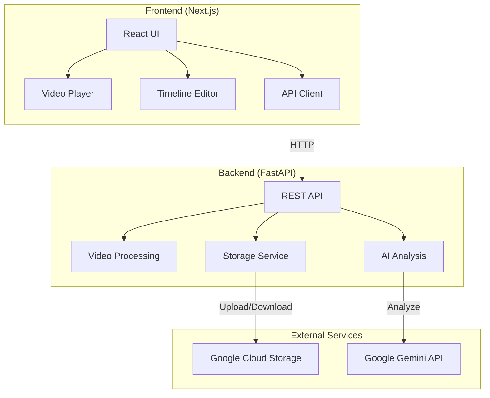

# AI Short Video Generator

AIを活用して動画から自動的にハイライトを抽出し、短編動画を生成するWebアプリケーション


## 🎬 概要

このアプリケーションは、長い動画から自動的にハイライトシーンを検出し、30秒単位の短編動画を生成します。Google Gemini APIを使用した高度な動画解析により、最も興味深い部分を抽出します。

### 主な機能

- 📹 動画のドラッグ&ドロップアップロード
- 🤖 AI（Gemini）による自動ハイライト検出
- ✂️ タイムライン上でのハイライト編集
- 💾 選択したハイライトの動画ダウンロード
- 🎯 スコアベースのハイライト優先順位付け

## 🏗️ アーキテクチャ



## 🚀 セットアップ

### 前提条件

- Node.js 18.17以上
- Python 3.12以上
- Google Cloud プロジェクト
- Gemini API キー または Vertex AI の認証情報

### 1. リポジトリのクローン

```bash
git clone https://github.com/HosakaKeigo/short-video-ai-generator-public.git
cd short-video-ai-generator-public
```

### 2. バックエンドのセットアップ

```bash
cd backend

# Poetryのインストール（未インストールの場合）
pip install poetry

# 依存関係のインストール
poetry install

# 環境変数の設定
cp .env.example .env
```

`.env`ファイルを編集し、以下の環境変数を設定：

```bash
# Google Cloud Storage
GCS_BUCKET_NAME=your-bucket-name
GCS_PROJECT_ID=your-project-id

# 認証方法1: Application Default Credentials
GOOGLE_APPLICATION_CREDENTIALS=./credentials/service_account_key.json

# 認証方法2: Gemini API Key（代替案）
GOOGLE_API_KEY=your-gemini-api-key
```

Google Cloud Storageのセットアップ：

```bash
# CORS設定の適用
./setup-gcs-cors.sh
```

開発サーバーの起動：

```bash
poetry run uvicorn app.main:app --reload --port 8080
```

### 3. フロントエンドのセットアップ

```bash
cd frontend

# 依存関係のインストール
npm install

# 環境変数の設定
cp .env.example .env.local
```

`.env.local`ファイルを編集：

```bash
# バックエンドAPIのURL
BACKEND_API_URL=http://localhost:8080
```

開発サーバーの起動：

```bash
npm run dev
```

アプリケーションは http://localhost:3000 でアクセスできます。

## 📚 使い方

1. **動画のアップロード**: ドラッグ&ドロップまたはクリックして動画を選択
2. **AI解析**: 「AIで解析」ボタンをクリックして自動解析を開始
3. **ハイライト選択**: タイムライン上でハイライトをクリックして選択
4. **時間調整**: 必要に応じて開始・終了時間を編集
5. **ダウンロード**: 「ダウンロード」ボタンで切り出した動画を保存

## 🛠️ 技術スタック

### フロントエンド
- **Framework**: Next.js 14 (App Router)
- **Language**: TypeScript
- **Styling**: Tailwind CSS
- **State Management**: Zustand
- **UI Components**: shadcn/ui

### バックエンド
- **Framework**: FastAPI
- **Language**: Python 3.12
- **Package Manager**: Poetry
- **Video Processing**: FFmpeg
- **AI**: Google Gemini API (Vertex AI)

### インフラ
- **Storage**: Google Cloud Storage
- **Container**: Docker対応
- **Deployment**: Cloud Run対応

## 📁 プロジェクト構成

```
short-video-ai-generator/
├── frontend/              # Next.js フロントエンド
│   ├── src/
│   │   ├── app/          # App Router
│   │   ├── components/   # React コンポーネント
│   │   ├── lib/          # ユーティリティ関数
│   │   └── stores/       # 状態管理 (Zustand)
│   └── public/           # 静的ファイル
├── backend/              # FastAPI バックエンド
│   ├── app/
│   │   ├── api/          # APIエンドポイント
│   │   ├── core/         # 設定・ユーティリティ
│   │   ├── models/       # データモデル
│   │   └── services/     # ビジネスロジック
│   └── pyproject.toml    # Poetry設定
└── LICENSE               # MITライセンス
```

## 🔧 開発コマンド

### フロントエンド
```bash
npm run dev        # 開発サーバー
npm run build      # ビルド
npm run lint       # Lintチェック
npm run type-check # 型チェック
```

### バックエンド
```bash
poetry run uvicorn app.main:app --reload  # 開発サーバー
poetry run ruff check .                    # Lintチェック
poetry run ruff format .                   # フォーマット
poetry run pytest                          # テスト実行
```

## 🐳 Docker

```bash
# バックエンドのビルドと実行
cd backend
docker build -t video-ai-backend .
docker run -p 8080:8080 --env-file .env video-ai-backend
```

## 🤝 コントリビューション

1. このリポジトリをフォーク
2. 新しいブランチを作成 (`git checkout -b feature/amazing-feature`)
3. 変更をコミット (`git commit -m 'feat: 素晴らしい機能を追加'`)
4. ブランチをプッシュ (`git push origin feature/amazing-feature`)
5. プルリクエストを作成

## 📝 ライセンス

このプロジェクトはMITライセンスの下で公開されています。詳細は[LICENSE](LICENSE)ファイルを参照してください。

## 🙏 謝辞

- [Google Gemini](https://ai.google.dev/) - 動画解析AI
- [FFmpeg](https://ffmpeg.org/) - 動画処理
- [shadcn/ui](https://ui.shadcn.com/) - UIコンポーネント

## 📞 お問い合わせ

質問や提案がある場合は、[Issues](https://github.com/HosakaKeigo/short-video-ai-generator-public/issues)でお知らせください。
